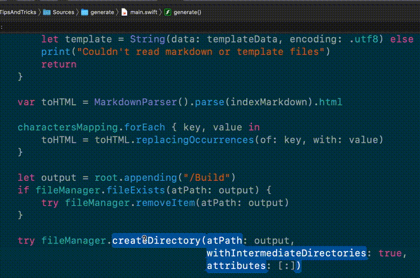
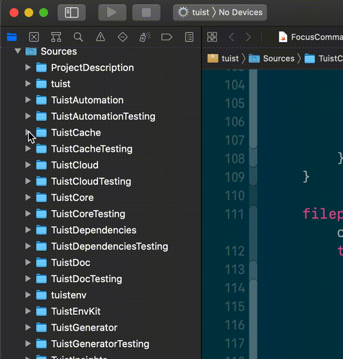

# The iOS Developer (and macOS?) Power User Cheat Sheet

## Table of Contents

- [Xcode](#Xcode)
	- [Showing/Hiding Panels](#panels)
	- [Opening and Navigating Files](#navigation)
	- [Cursor Navigation & Text Selection](#cursor)
	- [Text Editing](#text-editing)
	- [Searching](#searching)
	- [Cleaning](#cleaning)
	
- [Finder](#finder)
- [Terminal](#terminal)
- [Apps I Can't Live Without](#apps)
	- [Raycast](#raycast)
	- [Pastebot](#pastebot)
	
- [Legend](#legend)

-----

## Xcode

###  Showing/Hiding Panels
- `⌘`+`0` Show or hide Navigator
- `⌘`+`⌥`+`0` Show or hide Inspector
- `⌘`+`1`-`9` Show and switch Navigator tabs
- `⌘`+`⌥`+`1`-`4` Show and switch Inspector tabs
- `⌘`+`⇧`+`Y` Open or hide the Console
- `⌘`+`⌥`+`J` Filter in current Navigator Tab

###  Opening and Navigating Files
- `⌘`+`⇧`+`O` Open Quickly
	- Supports fuzzy search. Ex.: Type `PrCVC` to find **Pr**oduct**C**ollection**V**iew**C**ell
	- Supports opening the file in a specific line. Ex.: `ViewController.swift:58`

- `⌥`+`⇧` Choose where to open a file (either from Open Quickly, or when clicking in the Project Navigator)
- `⌘`+`⇧`+`J` Show current file in Project Navigator
- `⌘`+`J` Move focus of current editor
- `⌘`+`⇧`+`D` in the UI Hierarchy Debugger

###  Cursor Navigation & Text Selection
- `⌘`+`↑` or `↓` Move to end/beginning of a file. Combine with `⇧` to select text.
- `⌘`+`→` or `←` Move to end/beginning of a line. Combine with `⇧` to select text.
- `⌘`+`⌥`+`→` or `←` Move to end/beginning of a word. Combine with `⇧` to select text.
- `⌘`+`⌃`+`⇧`+`→` or `←` Camel case sensitive text selection

###  Text Editing
- `⌘`+`L` jump to a specific line
- `⌘`+`⇧`+`L` Show Library (Code Snippets or IB views)
- In the Jump bar: You can filter files or function by typing
- `⌘`+`↑`+`⌃` Show generated Swift interface (Only properties and method declarations)
- `⌥`+drag cursor up/down: multiple cursors
- `⌃`+`I` to automatically indent them
- `⌘`+`⌥`+`[` or `]` Move a line upwards/downwards
- `⌘`+`⌥`+`←` or `→` Fold/Unfold (see more variants in Editor > Code Folding)
- `⌘`+`+` or `-` Increase/Decrease font size
- `⌘`+`⌃`+`E` Edit All in Scope

###  Cleaning
- `⌘`+`⇧`+`K` Clean build folder
- `⌘`+`K` Clean console (also works on Safari's inspector)

###  Searching
- `⌘`+`⇧`+`F` Search in Workspace/Project (Same as `⌘`+`4`)
- `⌘`+`F` Search in current file
- Select code, then `⌘`+`E` to open the search box with the selection
- `⌘`+`G` goes to the next occurrence; `⌘`+`⇧`+`G` to the previous

### Miscellaneous
- `⌥`+ click on a type to show popover documentation

-----

##  Finder:

- `↵` rename, `space` to quicklook
- Install [quicklook plugins/extensions](https://github.com/sindresorhus/quick-look-plugins)
- Folders in Xcode or Finder (or any other **native** mac app using `NSOutlineView`): Click the Arrow+`⌥` to **recursively** collapse or expand nested folders

- Copy file as path

-----

##  Terminal:
- Use aliases to ease running frequent and/or long commands
- `xed .` - opens a Workspace (or a Project if a workspace doesn't exists) in the existing directory

-----

## Apps I Can't Live Without

###  [Raycast](https://raycast.com):
- Imagine Terminal and Spotlight had a baby
- Run custom scripts:
	- Clear derived data
	- Convert pasteboard (ex.: HEX to RGB)
	- Open commonly used directories
- [Community based repo for scripts](https://github.com/raycast/script-commands)

###  [Pastebot](https://tapbots.com/pastebot):
- Clipboard History: Never be afraid copying something and losing a copied content
- Quick Paste
- Filters: transform clipboard data

##  Legend
- `⌘` Command
- `⇧` Shift
- `⌥` Option (or Alt)
- `⌃` Control (or Ctrl)
- `←` Left Arrow
- `→` Right Arrow
- `↑` Up Arrow
- `↓` Down Arrow
- `↵` Enter/return

# Want to add your favorite shortcut(s)? [Add yours here](https://github.com/natanrolnik/TipsAndTricks/blob/master/Index.md).